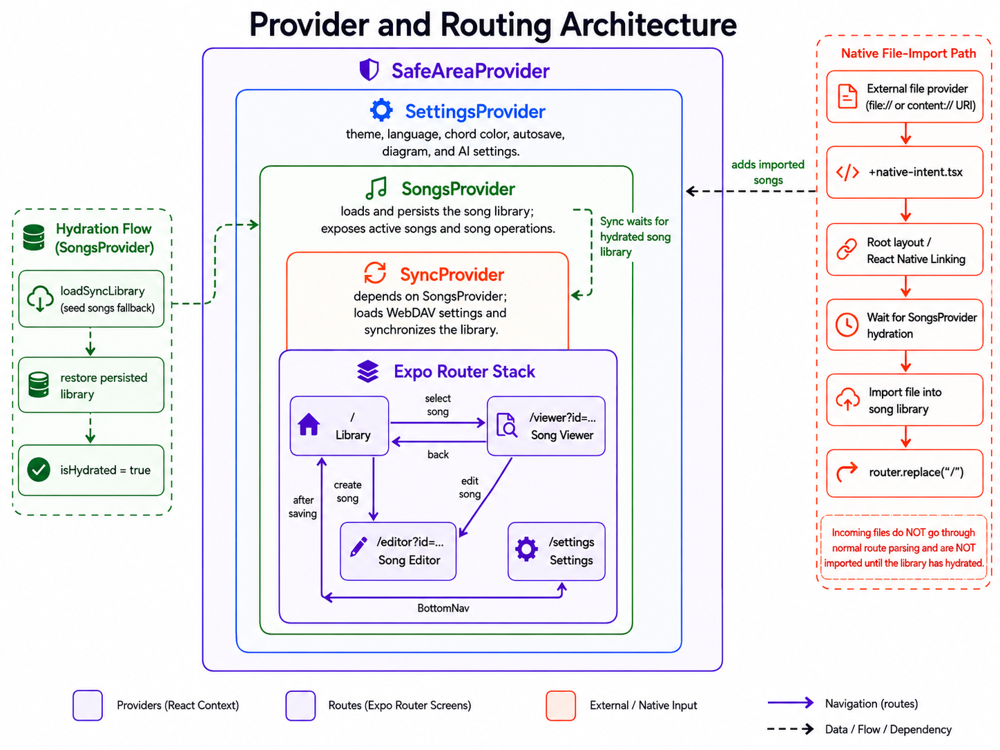

# Architecture and Routing

Back to [Documentation](../README.md).

## Repository Layout

```text
assets/                 App icons, splash assets, and other static resources
plugins/                Expo config plugins
src/app/                Expo Router routes and root layout
src/components/         Reusable React Native components
src/constants/          Seed data and application constants
src/context/            Settings, song library, and sync providers
src/data/               Offline chord voicing data
src/db/                 Legacy storage-backed schema and repository abstraction
src/i18n/                Translation manager and locale files
src/types/              Domain and persistence types
src/utils/              Parsing, storage, import/export, sync, and music helpers
.maestro/               Android system-test flows
```

## Bootstrap

The root layout wraps the router with providers in this order:

```text
SafeAreaProvider
└── SettingsProvider
    └── SongsProvider
        └── SyncProvider
            └── Expo Router Stack
```

Provider responsibilities:

- `SettingsProvider` loads theme, language, chord color, Auto Save, diagram, and AI concurrency settings.
- `SongsProvider` loads the library, exposes song operations, and persists library changes.
- `SyncProvider` loads WebDAV credentials, synchronizes the library, and reacts to foreground and library changes.
- The root layout receives native file URLs and waits for song hydration before importing them.

This ordering matters. Sync depends on the song library, and native incoming files must not be imported before library hydration finishes.



## Routes

| Route | Source | Responsibility |
| --- | --- | --- |
| `/` | `src/app/index.tsx` | Library, search, filters, favorites, deletion, creation, and single-song export |
| `/viewer?id=...` | `src/app/viewer.tsx` | Chord rendering, transposition, split view, font controls, and edit navigation |
| `/editor?id=...` | `src/app/editor.tsx` | Song creation or editing, tags, ChordPro source, undo/redo, Auto Save, and font scale |
| `/settings` | `src/app/settings.tsx` | Appearance, language, import/export, AI import, and WebDAV synchronization |
| Native intent hook | `src/app/+native-intent.tsx` | Keeps incoming file and content URLs out of normal route parsing |

The viewer and editor use the `id` query parameter to select an existing song. Without an ID, the editor creates a new internal song ID.

## Component Boundaries

Screens own route-level state and user actions. Reusable components render focused controls:

- `SongItem` renders a library row and long-press actions.
- `SearchBar` renders the library search field.
- `FilterTabs` renders generated filter tabs.
- `ChordSheet` parses and renders ChordPro content.
- `ChordPicker` builds a chord for insertion into the editor.
- `ChordDiagram` renders offline guitar voicings.
- `BottomNav` handles Library and Settings navigation.

## TypeScript Conventions

The `@/*` alias maps to `src/*`. Use explicit domain types from `src/types` and keep strict TypeScript enabled.

Prefer direct module imports when the relevant barrel does not expose a symbol. Keep imports ordered by React/React Native, third-party libraries, aliased project modules, and relative modules.
