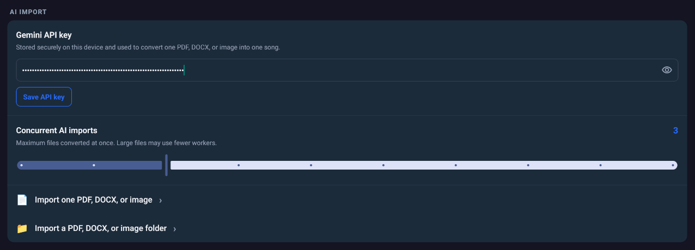
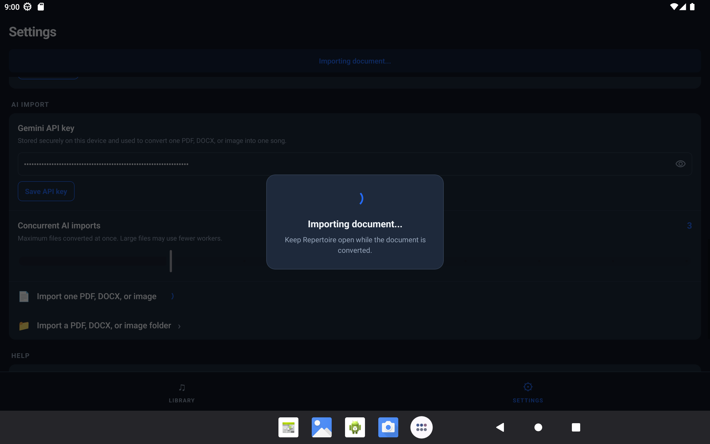

# AI Document and Image Import

Back to [Documentation](../README.md).

AI import converts a PDF, Word document, or supported image into one ChordPro song using Google Gemini.

## Requirements

- A Gemini API key
- Internet access
- A supported file
- The app remaining in the foreground during conversion

Supported formats are PDF, DOCX, PNG, JPG, JPEG, WebP, HEIC, and HEIF.

## Save an API Key

Open Settings and find the AI Import section:

1. Enter a Gemini API key.
2. Use the visibility control if needed.
3. Tap Save API key.

On Android, the key is stored with Expo SecureStore. On web, it is stored in session storage and is therefore limited to the browser session.

## Import One File

Choose the single-document import action and select one supported file. Each selected document becomes exactly one song, even when a PDF has multiple pages.

The conversion attempts to return:

- Title
- Artist
- Key
- Tags
- ChordPro content
- Warnings for uncertain or missing information

Review the generated song in the editor because AI conversion can misread lyrics, metadata, or chord positions.

Keep the app in the foreground. Leaving the app interrupts the request.

## Import a Folder

Folder import is available on native platforms:

1. Choose the folder import action.
2. Select a folder.
3. Wait for the progress display to finish.
4. Review the imported songs and any reported failures.

The importer scans supported top-level files and does not traverse subfolders. Files are processed in filename order. Successful songs are committed as a batch after processing completes.

## Limits and Retry Behavior

- Maximum source size: 50 MB
- Request timeout: 60 seconds
- Default concurrent imports: 3
- Configurable concurrency: 1 through 10
- Maximum retries for retryable failures: 3

The importer also applies an active-memory budget, so large files can reduce actual concurrency.

Retryable network, rate-limit, and server failures may be retried. Invalid keys, unsupported files, oversized files, cancellation, and foreground interruption are not treated as successful imports.

## Images from Open With

On native builds, a supported image received through Open With also uses the saved Gemini key and is imported as one song. If no key is available, the app offers navigation to Settings.

## Privacy and Costs

The selected document or image is sent to Google Gemini for conversion. Review Google's service terms, privacy policy, and pricing before using a key with personal or copyrighted material.

See [Privacy and data handling](privacy.md) for the complete data-handling summary.
