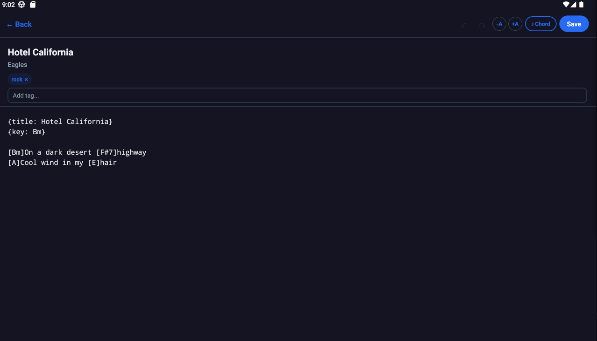
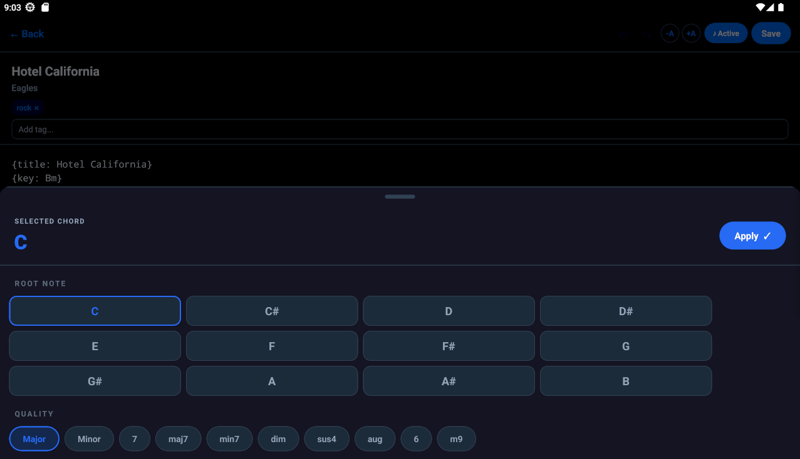

# Editing Songs

Back to [Documentation](../README.md).

## Create or Edit

To create a song:

1. Open the Library.
2. Tap the floating `+` button.
3. Enter song content in the editor.
4. Tap Save, or leave the editor while Auto Save is enabled.

To edit an existing song, open it in the viewer and tap Edit.

A new song is not added when its content is empty. A title alone is not enough.

## Metadata

The editor provides fields for:

- Title
- Artist
- Tags

Tags are converted to lowercase. Add a tag by typing it and pressing the keyboard Done action or the visible `+` button. Existing tags that match the typed prefix appear as suggestions. Tap a tag chip to remove it.

The editor does not have a separate original-key field. A `{key: G}` directive in the content renders a key label in the viewer, but it does not populate the library key badge automatically.



## ChordPro Basics

Chords are placed immediately before the lyric position they belong to:

```text
{title: Amazing Grace}
{key: G}

[G]Amazing [C]grace, how [G]sweet the sound
That [G]saved a [D]wretch like [G]me
```

Common directives include:

```text
{title: Song title}
{artist: Artist name}
{key: G}
{comment: Chorus}
```

The editor stores the raw text. The viewer interprets square-bracket chords and recognized directives when rendering.

## Chord Picker

Tap the Chord button in the editor header to open the assisted picker:

1. Choose a root note.
2. Choose a quality.
3. Optionally choose extensions such as add9, add11, or add13.
4. Tap Apply.

The generated chord is inserted in brackets at the current text cursor position. The picker uses sharp-spelled roots and supports common qualities including Major, Minor, 7, maj7, min7, dim, sus4, aug, 6, and m9.



## Undo and Redo

Text changes are grouped after a short pause, so normal typing does not create one history entry per keystroke. Chord-picker insertions are recorded immediately.

Undo and redo apply to song content only. They do not change title, artist, tags, or font scale.

## Font Size

The `-A` and `+A` buttons change the editor font scale by 10 percent per tap. The minimum scale is 50 percent. There is no upper limit or displayed percentage.

The editor font scale is persisted with the song when the draft is saved.

## Save and Auto Save

- Save persists the current draft and keeps the editor open.
- Auto Save is enabled by default.
- With Auto Save enabled, changes are saved after approximately two seconds of inactivity.
- Going Back also saves when Auto Save is enabled.
- With Auto Save disabled, Going Back does not save pending changes. Tap Save first.

See [Settings](settings.md) for changing Auto Save and [Troubleshooting](troubleshooting.md) for discarded edits.
