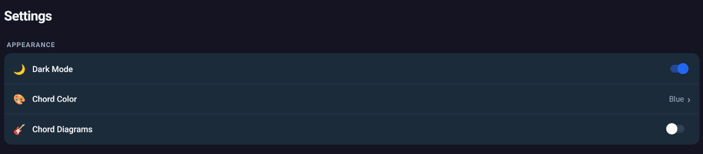

# Settings and Personalization

Back to [Documentation](../README.md).

Open Settings from the bottom navigation.

## Appearance

Appearance options include:

- Dark Mode
- Chord Color
- Chord Diagrams

Chord Color is also used as the app accent color. Available colors are Blue, Green, Purple, Red, Orange, and Pink.

Chord Diagrams controls whether recognized guitar diagrams appear in the viewer.

The default appearance uses dark mode, a blue accent, and diagrams disabled.

## Behavior

Auto Save controls editor persistence:

- Enabled: changes save after inactivity and when leaving the editor.
- Disabled: use Save before leaving if edits must be retained.

Language controls the interface language. Available languages are English, Espanol, Francais, Deutsch, Portugues, and Turkce. The selected language is saved and applied immediately.

## Data Actions

The Data section contains:

- Export Library
- Import Song(s)

See [Importing, exporting, and sharing](import-export.md).

## WebDAV Sync

WebDAV fields and synchronization actions are described in [WebDAV cloud synchronization](cloud-sync.md).

## AI Import

The AI Import section contains:

- Gemini API-key storage
- Single-document import
- Native folder import
- Import concurrency control

See [AI document and image import](ai-import.md).

## Built-in Help

Settings also contains short in-app help for basic usage and ChordPro syntax. Use it as a quick reference; the full workflows are described in these guides.
